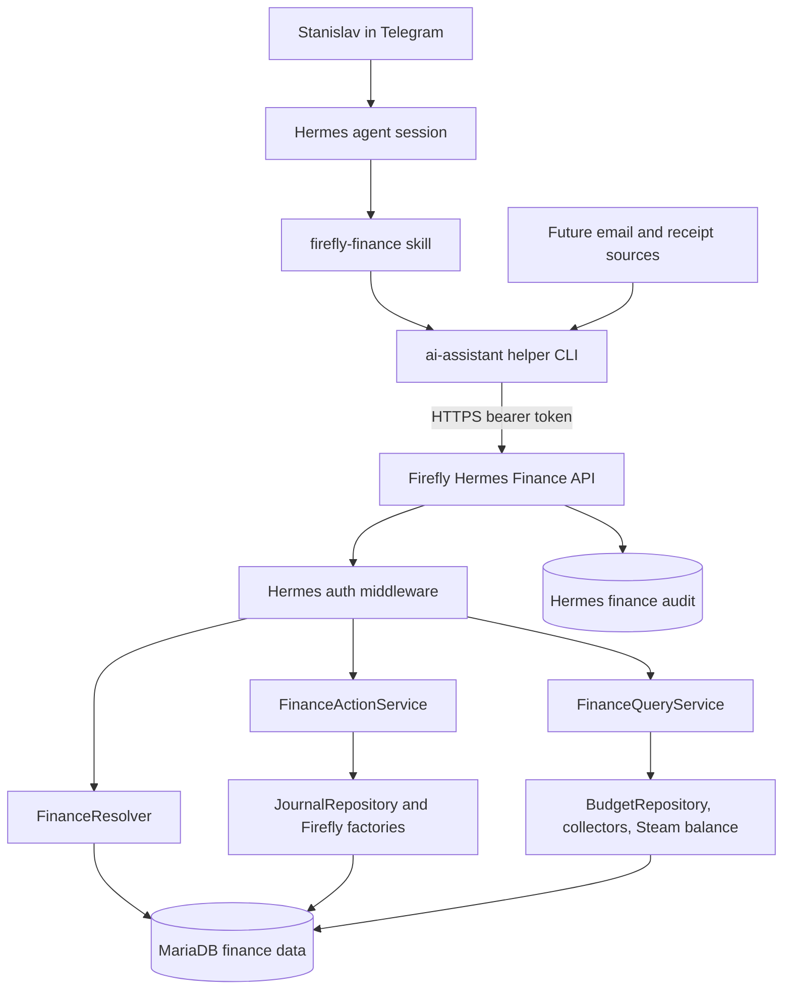
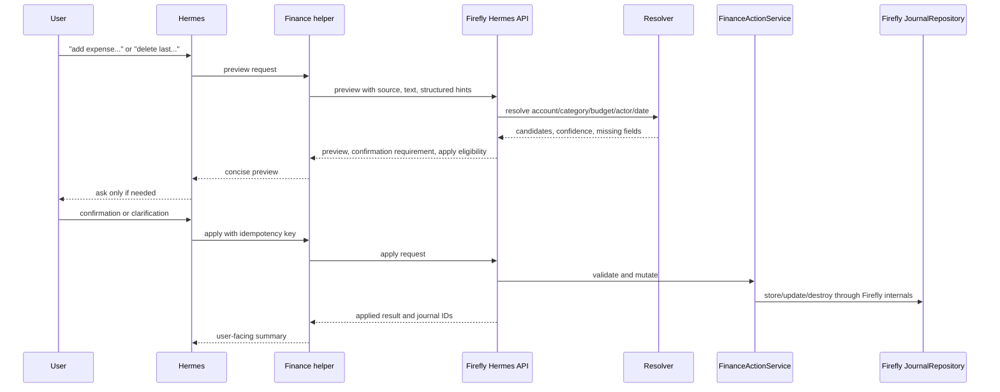

# Hermes Finance Skill - Plan

## Goal Capsule

| Field | Value |
|---|---|
| Objective | Give Hermes a safe finance skill for Firefly III so Stanislav can create, inspect, report, correct, and later import finance records through natural-language requests instead of manual UI work. |
| Primary owner | Firefly III owns the trusted finance operation API and data invariants; Hermes owns natural-language recognition, skill instructions, helper CLI, Telegram UX, and future automation entry points. |
| Authority hierarchy | User chat instruction > Hermes finance skill contract > Firefly operation API validation > Firefly repository/model invariants > imported legacy docs. |
| Execution profile | Clean sensitive local artifacts first, then build read/report capability before mutation; mutation paths require deterministic apply gates, idempotency, audit records, and local Docker verification against a production-like dump before production enablement. |
| Stop conditions | Stop before production mutation if local Docker cannot run PHP 7.4/Laravel 5.8, Firefly API auth cannot be isolated to Hermes, resolver output is ambiguous, or production report queries are not bounded on the full local dump. |
| Tail ownership | Firefly runbook documents token rotation, dump refresh, rollback, audit inspection, and the rule that future email/receipt pipelines call the same finance operation API. |

---

## Product Contract

### Summary

Hermes should understand finance requests such as "добавь расход на еду с CGD в бюджет Стас и Таня", "сколько осталось потратить из текущего бюджета", "покажи доходы по отелю", and "удали последнюю мою транзакцию про еду".
The product should feel like a careful finance assistant: it can resolve the user's domain language into Firefly accounts, categories, budgets, actors, and hotels, but it previews ambiguous or destructive actions before applying them.

The plan treats current Firefly data as a real production ledger, not a demo database.
Local development therefore needs a Docker stack that can import a full production dump and run the old Laravel 5.8 fork under PHP 7.4.

### Problem Frame

The current Firefly fork already stores the user's finance ledger, hotel cashboxes, categories, budgets, and Kassa integration.
It does not expose a safe high-level interface for an agent: the public Firefly API is generic, the Kassa endpoint is too permissive and hardcoded for web forms, and direct SQL writes would bypass Firefly's paired-transaction, budget, category, note, metadata, and cache behavior.

Hermes needs a small domain API and a skill wrapper rather than broad database access.
The first version should support manual Telegram requests well, while leaving source metadata ready for later email and receipt automation.

### Actors

- A1. Stanislav: primary user asking Hermes to add, inspect, change, or remove finance records.
- A2. Hermes interactive agent: recognizes finance intent, calls the finance helper, asks clarifying questions, and returns concise Telegram output.
- A3. Firefly finance operation API: trusted server-side layer that resolves domain entities, previews changes, applies mutations through Firefly internals, and records audit trails.
- A4. Future automation sources: email triage, bank/payment emails, hotel workflows, and receipt OCR pipelines that submit source-tagged finance previews through the same contract.

### Requirements

**Finance Operations**

- R1. Hermes can create withdrawals, deposits, and transfers from natural-language requests with amount, currency, date, source/destination account, category, budget, domain actor, notes, and source metadata.
- R2. Hermes can preview a proposed transaction before applying it, including resolved Firefly IDs, human-readable names, deterministic apply eligibility, missing fields, and whether user confirmation is required.
- R3. Hermes can find recent transactions by fuzzy criteria such as actor, account, category, budget, amount, date range, hotel, source, and text in description or notes.
- R4. Hermes can update or delete existing transactions only through a preview-confirm flow that shows the exact candidate journal and requires explicit confirmation for destructive changes.
- R5. Hermes can report budget remaining, period spending, income, expenses, transfers, account balances, hotel cashbox balances, and monthly summaries by actor, hotel, category, budget, account, and currency.

**Domain Resolution**

- R6. The system understands local finance vocabulary: "я"/"Стас", "Таня", "мы", "Стас и Таня в Португалии", "CGD", "наличные евро", "Казанская 8-10", "Казанская 23", "гостевые комнаты", and similar aliases.
- R7. The resolver returns multiple candidates when a phrase is ambiguous and does not mutate the ledger until Hermes or the user resolves the ambiguity.
- R8. Domain actors are modeled as finance entities, not Laravel users; the current Firefly Laravel owner remains the user that owns the ledger unless a future multi-user requirement is introduced.

**Safety and Audit**

- R9. Every mutating request is idempotent and audit logged with request source, resolved IDs, dry-run/apply mode, created or changed journal IDs, user-facing summary, error details, and scrubbed/truncated free text.
- R10. Hermes auth is isolated from the existing Kassa middleware and from broad database credentials; no skill file, prompt, or repo doc contains live tokens, dumps, or secret-bearing generated notes.
- R11. Future email and receipt automations submit source-tagged structured previews to the same API and never write directly to Firefly tables.

**Local and Operational Readiness**

- R12. Local Docker can run this Firefly fork with PHP 7.4, MariaDB-compatible storage, Redis, and Nginx/Apache without relying on the host PHP version.
- R13. A full production dump can be copied into local Docker for private testing, with dump files ignored by git and a documented sanitization path if data ever leaves the developer's machine.
- R14. Stale generated docs and untracked sensitive notes are removed or redacted so future agents do not use obsolete secrets or old deployment assumptions as authority.
- R15. Production rollout includes dry-run validation, monitoring, and rollback instructions; Firefly's current RU host memory/swap pressure is resolved or query-bounded before the first production dry-run, not only before scheduled automation.

### Key Flows

- F1. Add expense: the user asks Hermes to add a spend; Hermes calls preview; Firefly resolves account/category/budget/actor; Hermes asks only for missing, ambiguous, high-value, or policy-blocked fields; Firefly creates the transaction through the existing journal repository after confirmation or deterministic server-side auto-apply eligibility.
- F2. Budget remaining: the user asks how much remains in the current budget; Firefly selects the active budget limit covering the requested date, calculates spent in the same currency only, and returns budgeted, spent, left, overspent, period dates, and currency.
- F3. Delete last transaction: the user asks to delete a recent transaction; Firefly returns the most likely candidate and alternatives; Hermes shows the candidate and requires explicit confirmation before deletion.
- F4. Hotel report: the user asks for income or expense by hotel or cashbox; Firefly resolves the hotel/cashbox actor and returns period totals with drilldown candidates.
- F5. Receipt source preview: the user sends a receipt; Hermes extracts structured fields as untrusted data, sends a normal transaction preview with `source_type` and `source_id`, and asks clarifying questions before creating a transaction.
- F6. Email source preview: an email automation extracts a potential transaction from mail and submits a normal transaction preview with source metadata; non-interactive sources never auto-apply in the first release.

### Acceptance Examples

- AE1. Given "добавь 104 евро еда с CGD за сегодня в бюджет Стас и Таня в Португалии", Hermes previews a EUR withdrawal from the CGD asset account to the Стас expense actor, category `Еда`, the current Portugal budget limit, and then creates one Firefly journal when confirmed or deterministically eligible for create auto-apply.
- AE2. Given "сколько осталось потратить из текущего бюджета стас и таня в португалии", Hermes returns the current EUR month limit, EUR spent amount, EUR remaining amount, overspend if any, and the dates used for the calculation without mixing RUB or USD transactions into the EUR remaining value.
- AE3. Given "удали последнюю мою транзакцию про еду", Hermes returns the latest matching food transaction candidate with date, amount, account, category, budget, and description, then waits for confirmation before deletion.
- AE4. Given "покажи доходы по Казанской 8-10 за месяц", Hermes returns income totals for the hotel actor/cashbox scope and can list the underlying transactions on request.
- AE5. Given receipt-derived fields with missing category confidence, Hermes submits a source-tagged transaction preview and asks for the missing category or budget rather than guessing into the ledger.

### Scope Boundaries

In scope:

- Build a Firefly-owned operation API for Hermes finance reads, previews, creates, updates, deletes, and reports.
- Build the Hermes skill and helper script that call this operation API from Telegram sessions and future cron automations.
- Build local Docker parity and production dump workflow because meaningful validation depends on real account, budget, category, and cashbox data.
- Sanitize or remove stale local documentation, bank exports, and untracked generated notes that contain obsolete deployment context, financial data, or secrets before implementation agents use the repo.

Deferred to follow-up work:

- Fully automatic email-to-transaction application without user review.
- A dedicated draft table/controller lifecycle for email and receipt ingestion.
- Full receipt attachment lifecycle, including storing receipt images as Firefly attachments, beyond the source-tagged preview contract.
- Bank feed integrations and payment-provider polling.
- Full upstream Firefly III upgrade or Laravel modernization.
- Multi-Laravel-user finance ownership beyond the current user-owned ledger.

Outside this product's identity:

- Turning Hermes into a general SQL agent over the finance database.
- Replacing Firefly III's transaction engine with a parallel finance ledger.
- Reusing the Kassa endpoint as the authorization model for Hermes.

---

## Planning Contract

### Current System Findings

The local Firefly fork is an old Laravel 5.8 application with Passport API auth, Twig views, Firefly repositories, and custom Kassa routes.
Host PHP is too new for local artisan usage, so local parity must come from Docker with PHP 7.4.
Production runs from the same fork under PHP 7.4 FPM with MariaDB 10.11, Redis, and Nginx at `money.ubertek.ru`.

The existing public API can create and delete generic transactions, but it does not know Stanislav's aliases, confidence rules, idempotency, or finance-assistant confirmation semantics.
The custom Kassa controller uses `Auth::onceUsingId(1)`, hardcoded UUID allowlists, `accounts.kassa_id`, and direct form-oriented logic; it is useful domain evidence but not a security pattern to extend.

Production data confirms that domain people and hotels are Firefly accounts, not app users.
Examples include paired Expense and Revenue accounts for `Стас`, `Таня`, `Игорь`, `Казанская 8-10`, and `Казанская 23`, plus asset cashbox accounts with `kassa_id`.
Budgets are real monthly limits, with `Стас и Таня в Португалии (EUR)` carrying month-by-month limits such as June and July 2026.

### Key Technical Decisions

- KTD1. Add a Firefly-owned Hermes operation API rather than letting Hermes write SQL directly.
  Firefly's existing `JournalRepositoryInterface`, `TransactionJournalFactory`, `TransactionFactory`, `JournalUpdateService`, destroy service, budget repository, and collectors preserve paired transaction invariants, budget/category links, notes, journal metadata, events, and cache invalidation better than raw SQL.
  Delete still needs runbook coverage because the existing destroy service soft-deletes journals and transactions but does not fully preserve every linked artifact for undo.
- KTD2. Keep the existing Firefly API available but wrap it with domain operations.
  Generic endpoints are good primitives, but Hermes needs previews, confidence, aliases, idempotency, audit, and safer destructive flow semantics that do not belong in prompts alone.
- KTD3. Do not reuse the Kassa middleware for Hermes.
  Kassa's `Auth::onceUsingId(1)` and query-string `UserId` pattern is acceptable only as legacy evidence; Hermes MVP uses a custom middleware with a configured bearer token hash, configured ledger user id, source IP allowlist, and tighter throttles for mutation routes.
- KTD4. Store the initial domain alias catalog in Firefly config, not only in Hermes prompts.
  The first alias set is known from production accounts and import mappings, so a reviewed config file is simpler than a mutable alias table; move aliases to a table later only when non-developer edits become real.
- KTD5. Make local Docker production-like before shipping finance mutations.
  The app is incompatible with local PHP 8.5, and realistic testing requires imported categories, budgets, cashboxes, and historical data.
- KTD6. Treat future email and receipt ingestion as source-tagged previews over the same API.
  This keeps ingestion-specific parsing outside Firefly while keeping finance validation, preview, and mutation behavior centralized without adding a premature draft subsystem.

### High-Level Technical Design



Create and delete flows use the same API but different confirmation gates:



Create auto-apply is a server-side deterministic state, not an LLM confidence score.
It is allowed only when every required slot has one exact or configured alias match, source/destination account types match the requested transaction type, amount and currency are explicit, the amount is below the configured ceiling, the date is explicit or safely defaulted, and the request source is interactive.
Updates, deletes of pre-existing journals, high-value creates, ambiguous resolver output, and all future non-interactive email/receipt sources require confirmation.

### Output Structure

Expected new or materially changed files:

```text
firefly-iii/
  app/Api/V1/Controllers/Hermes/
  app/Api/V1/Requests/Hermes/
  app/Models/HermesFinanceAudit.php
  app/Services/Hermes/
  config/hermes_finance.php
  database/migrations/*_create_hermes_finance_audits.php
  database/migrations/*_add_kassa_id_to_accounts.php
  docker/dev/
  docs/development/local-docker.md
  docs/operations/hermes-finance-runbook.md
  tests/Api/V1/Controllers/Hermes/
  tests/Unit/Services/Hermes/

ai-assistant/
  hermes/scripts/firefly-finance.py
  hermes/skills/firefly-finance/SKILL.md
```

### Dependencies and Prerequisites

- Docker must be available locally and able to run the Firefly stack without relying on host PHP.
- Current untracked sensitive notes, bank exports, and generated context files must be redacted, moved outside the repo, or gitignored before implementation agents are given the working tree.
- The production dump may be copied into local Docker for private testing; dump files and extracted storage artifacts stay out of git.
- Firefly production needs a dedicated Hermes token hash, ledger user id, source allowlist, and mutation throttle before the skill is enabled outside local dry-run.
- RU production currently has high swap pressure and `xray` OOM history; avoid production dry-runs that run broad reports until baseline memory pressure is understood or all queries are proven bounded on the full local dump.
- RU `fail2ban` has been stopped, disabled, and masked so legitimate automation SSH attempts no longer lock out access.

### Alternative Approaches Considered

| Approach | Decision | Rationale |
|---|---|---|
| Direct SQL writes from Hermes | Reject | Bypasses paired transactions, budget/category pivot logic, notes, metadata, events, cache invalidation, and deletion behavior. |
| Use only the generic Firefly API from Hermes | Partially reject | Good primitive for simple create/list, but lacks domain aliases, preview semantics, idempotency, audit, and safe deletion by fuzzy criteria. |
| Extend Kassa endpoint | Reject | Kassa is form-specific, query-string authenticated, hardcoded, and uses `Auth::onceUsingId(1)`. |
| Build a sidecar service with DB credentials | Reject for MVP | Adds another trusted ledger writer and duplicates Firefly internals; only consider later for read-heavy analytics if Firefly API performance is insufficient. |
| Firefly-owned high-level API plus Hermes helper/skill | Choose | Keeps finance invariants server-side and gives Hermes a small, testable operation surface. |

### Risks and Mitigations

| Risk | Mitigation |
|---|---|
| Wrong transaction created because natural-language resolution is ambiguous | Resolver returns confidence and candidates; mutations require missing-field clarification or explicit confirmation. |
| Duplicate transactions from retries or Telegram resend | Apply requests require idempotency keys stored with a unique `(source, idempotency_key)` audit constraint before mutation. |
| Destructive deletes by fuzzy wording | Delete and update are two-step preview-confirm operations; confirmation references a short-lived preview token bound to the exact action and journal target. |
| Production data leaked into repo | Dump paths, bank exports, generated context docs, and local secret notes are gitignored or moved out of the repo before implementation starts. |
| Audit records duplicate financial PII or prompt-injection text | Audit stores structured fields with scrubbed/truncated free text; audit reads remain operator-only and are not exposed through Hermes read APIs. |
| Local tests pass against fake data but fail on real aliases | Local Docker supports full private prod dump import and fixture snapshots for known aliases. |
| Firefly host resource pressure causes failed finance operations | Rollout starts with bounded read/report dry-runs only after full-dump query benchmarks; resolve swap/OOM before scheduled ingestion. |
| Current schema drift is not captured in migrations | Add an idempotent migration for `accounts.kassa_id` and Hermes audit schema so new local clones match production. |

### Phased Delivery

| Phase | Units | Gate |
|---|---|---|
| 0. Repo hygiene and local runtime | U0, U1 | Sensitive local artifacts are out of agent context, Docker boots PHP 7.4, and a production-like dump can be imported privately. |
| 1. Read-only finance assistant | U2, U3, U5, U6 read/report commands | Hermes can resolve aliases and answer budget/balance/report questions without mutation. |
| 2. Create transactions | U4 create path, U6 create commands | Low-risk creates pass deterministic apply gates, idempotency, audit, and local dump tests. |
| 3. Correct and delete | U4 update/delete path | Existing journal update/delete requires confirmation token and stale-target revalidation. |
| 4. Future source preparation | U7 | Email/receipt sources can submit source-tagged previews later without a separate writer. |

---

## Implementation Units

### U0. Working Tree Secret and Data Hygiene

- **Goal:** Remove sensitive local artifacts from agent context before implementation begins.
- **Requirements:** R10, R13, R14.
- **Dependencies:** None.
- **Files:**
  - `firefly-iii`: `.gitignore`, remove or move untracked bank exports and generated context/summary docs, redact any retained docs under `docs/`.
  - `firefly-iii`: `docs/development/local-docker.md` for private dump path conventions.
- **Approach:** Treat local generated summaries, bank exports, dumps, and context notes as private runtime artifacts unless they are explicitly redacted and documented.
  Add ignore rules for dump directories, `*.tsv`/bank exports, and generated `*_CONTEXT.md`/`*_SUMMARY.md` files before handing the repo to implementation agents.
  Rotate any credential found in a local doc before production rollout; do not reproduce the value in commits or logs.
- **Patterns to follow:** Git should contain source, migrations, prompts, and redacted docs, not OAuth tokens, DB passwords, bank exports, or prod dumps.
- **Test scenarios:**
  - `git status --short` shows no untracked bank export or secret-bearing generated context file intended for commit.
  - `rg` over retained docs finds no live token, DB password, OAuth credential, or private dump path.
  - `.gitignore` prevents future local dump and bank export artifacts from appearing as commit candidates.
- **Verification:** Implementation agents can read the repo without being exposed to avoidable secrets or raw bank exports.

### U1. Local Firefly Docker and Data Baseline

- **Goal:** Make local Firefly development reliable with PHP 7.4 and production-like MariaDB data.
- **Requirements:** R12, R13, R14, R15.
- **Dependencies:** U0.
- **Files:**
  - `firefly-iii`: `docker-compose.yml`, `docker/dev/php74/Dockerfile`, `docker/dev/nginx.conf`, `.env.example`, `.gitignore`, `docs/development/local-docker.md`.
  - `firefly-iii`: remove or redact stale untracked docs such as generated dashboard summaries before they can become agent context.
- **Approach:** Replace the stale root compose shape that points at an upstream image/Postgres with a repo-mounted PHP 7.4 app, MariaDB 10.11, Redis, and web server stack that mirrors production closely enough for artisan, tests, and API smoke checks.
  Pin Composer's platform PHP to 7.4 inside the container and treat `composer install` plus `php7.4 artisan` boot as the first spike gate because this old lockfile may not resolve cleanly on a fresh image.
  Document a private production dump import path using `mysqldump --single-transaction` on production, secure copy to local, import into the local DB service, regenerate local-only app keys or Passport material if needed, and keep dump files ignored.
  Add a clear note that a full dump is acceptable for private local work but must be sanitized before sharing.
- **Patterns to follow:** Production uses `/usr/bin/php7.4 artisan`, MariaDB, Redis, and Nginx/PHP-FPM; local host PHP 8.5 is not a valid runtime for this fork.
- **Test scenarios:**
  - Containerized `composer install` completes with PHP 7.4 platform settings and no host PHP dependency.
  - Fresh clone can start the Docker stack and serve the login page.
  - Imported production dump exposes real budgets, categories, accounts, and Kassa `kassa_id` values locally.
  - `php7.4 artisan route:list` works inside the container without host PHP.
  - Dump files, storage copies, and local env files do not appear in `git status`.
- **Verification:** Local Docker is the default documented test path for all later units.

### U2. Hermes Auth, Schema, and Audit Foundation

- **Goal:** Add a dedicated trusted boundary for Hermes finance operations.
- **Requirements:** R9, R10, R13, R15.
- **Dependencies:** U1.
- **Files:**
  - `firefly-iii`: `routes/api.php`, `app/Http/Middleware/HermesFinance.php`, `config/hermes_finance.php`, `app/Models/HermesFinanceAudit.php`.
  - `firefly-iii`: `database/migrations/*_create_hermes_finance_audits.php`, `database/migrations/*_add_kassa_id_to_accounts.php`.
  - `firefly-iii`: `tests/Api/V1/Controllers/Hermes/HermesAuthTest.php`, `tests/Unit/Services/Hermes/HermesFinanceAuditTest.php`.
- **Approach:** Add `/api/v1/hermes/finance/*` routes protected by `HermesFinance` middleware, not the generic Kassa path.
  The middleware validates a configured bearer token hash with constant-time comparison, checks configured source CIDRs for production, maps requests to a configured ledger user id, and applies tighter throttles to mutation endpoints.
  Store audit records for preview and apply calls, including source, source id, idempotency key, request text after scrubbing/truncation, structured input, resolved entities, dry-run/apply mode, preview token hash, result journal IDs, and error summary.
  Enforce idempotency with a unique `(source, idempotency_key)` constraint on audit/apply records instead of a separate idempotency table.
  Add a formal idempotent migration for the production-only `accounts.kassa_id` column using a `hasColumn` guard so local and production schema stop drifting without duplicate-column failures.
- **Patterns to follow:** Existing API controllers use `auth:api`, request objects, Fractal-style JSON responses, and repository `setUser()` calls.
- **Test scenarios:**
  - Missing or wrong Hermes auth receives 401/403 and writes no mutation audit.
  - A valid Hermes request is associated with ledger user id 1 or configured user id.
  - Reusing an idempotency key returns the original mutation result and does not create another journal.
  - `accounts.kassa_id` migration is safe when the column already exists in production.
  - Mutation endpoint throttles and source allowlist reject requests before resolver or journal services run.
- **Verification:** Hermes endpoints are not reachable through Kassa auth and do not require database credentials outside Firefly.

### U3. Finance Domain Resolver

- **Goal:** Resolve natural-language finance entities into Firefly IDs with confidence and clarification candidates.
- **Requirements:** R2, R3, R6, R7, R8.
- **Dependencies:** U2.
- **Files:**
  - `firefly-iii`: `app/Services/Hermes/FinanceResolver.php`, `app/Services/Hermes/ResolvedFinanceIntent.php`.
  - `firefly-iii`: `config/hermes_finance_aliases.php`.
  - `firefly-iii`: `tests/Unit/Services/Hermes/FinanceResolverTest.php`, `tests/Feature/Hermes/FinanceResolverFixtureTest.php`.
- **Approach:** Build a resolver that can search accounts, account types, categories, budgets, budget limits, currencies, and hotel/cashbox aliases.
  Represent actor aliases separately from source asset accounts because `Стас` as an expense/revenue account and `Стас / CGD (ЕВРО)` as an asset account mean different sides of a transaction.
  Seed the initial alias catalog from existing `import/users.json`, `import/cats.json`, production account names, budget names, and Kassa UUIDs, while treating numeric legacy `kassa_id` values and UUID actor/hotel `kassa_id` values as separate namespaces.
  For budget limits, resolve the single limit covering the requested date; multiple matching limits or no matching limit is a result to surface, not a nearest-date fallback.
- **Patterns to follow:** Existing account/category/budget repositories already enforce ledger ownership; resolver should return DTOs and not mutate the ledger.
- **Test scenarios:**
  - "я", "стас", and "моя" resolve to the Стас domain actor where context expects an actor.
  - "CGD" resolves to the active EUR CGD asset account where context expects a source account.
  - "Казанская 8-10" resolves to hotel revenue/expense actors and cashbox candidates with role-specific confidence.
  - "Стас и Таня в Португалии" returns the correct active budget candidates and current budget limit when the date is in a known month.
  - Withdrawal side selection never resolves `Стас` the expense actor as a source asset account when the source phrase should be `Стас / CGD`.
  - Overlapping budget limits produce an ambiguity response; missing budget limits produce a no-limit response.
  - Ambiguous input returns candidates and `requires_confirmation` instead of choosing silently.
- **Verification:** Resolver output is stable enough for Hermes to ask a precise follow-up rather than exposing raw database ambiguity.

### U4. Transaction Preview, Create, Update, and Delete Operations

- **Goal:** Provide safe mutation endpoints for finance transactions.
- **Requirements:** R1, R2, R3, R4, R7, R9, R10.
- **Dependencies:** U2, U3.
- **Files:**
  - `firefly-iii`: `app/Api/V1/Controllers/Hermes/FinanceTransactionController.php`.
  - `firefly-iii`: `app/Api/V1/Requests/Hermes/FinanceTransactionPreviewRequest.php`, `app/Api/V1/Requests/Hermes/FinanceTransactionApplyRequest.php`, `app/Api/V1/Requests/Hermes/FinanceTransactionSearchRequest.php`.
  - `firefly-iii`: `app/Services/Hermes/FinanceActionService.php`, `app/Services/Hermes/FinanceTransactionPreview.php`.
  - `firefly-iii`: `tests/Api/V1/Controllers/Hermes/FinanceTransactionControllerTest.php`, `tests/Unit/Services/Hermes/FinanceActionServiceTest.php`.
- **Approach:** Implement preview endpoints for create/update/delete and apply endpoints that consume a short-lived preview token plus idempotency key.
  The preview token is single-use and bound to ledger user id, action, resolved payload hash, and for update/delete the target journal id plus `updated_at`; apply revalidates the target still matches and fails closed on mismatch.
  Store creations through `JournalRepositoryInterface->store()` using the same complete data shape as `TransactionRequest::getAll()`, including `user`, `notes`, per-split `identifier`, and all keys the factories read without null-coalescing.
  Store whole-journal updates through `JournalRepositoryInterface->update()` / `JournalUpdateService`, treating omitted split identifiers as deletes and therefore requiring the full split set in update previews.
  Store deletes through `JournalRepositoryInterface->destroy()` and document recovery limits in the runbook.
  Add `original-source` and notes/tags that make Hermes-created records searchable without exposing prompt text in user-facing fields.
- **Patterns to follow:** `app/Api/V1/Controllers/TransactionController.php`, `app/Api/V1/Requests/TransactionRequest.php`, `app/Factory/TransactionJournalFactory.php`, and `app/Factory/TransactionFactory.php`.
- **Test scenarios:**
  - Previewing a complete withdrawal returns source asset, destination expense actor, category, budget, amount, currency, date, and `can_apply=true`.
  - Applying the preview creates exactly one journal with two transactions, category links, budget links, note, and Hermes audit record.
  - A duplicate apply with the same idempotency key returns the same created journal IDs.
  - A minimal Hermes payload is expanded into the complete factory-safe journal array without undefined-index notices.
  - Update preview includes every existing split and rejects partial updates that would silently drop split identifiers.
  - Delete preview for "last food transaction" returns candidates ordered by recency and confidence and does not delete anything.
  - Delete apply without a matching unexpired preview token for the exact journal is rejected.
  - Delete preview with two same-day food candidates forces numbered disambiguation instead of picking one silently.
  - Invalid account type combinations fail before mutation.
- **Verification:** No Hermes mutation path inserts or deletes transaction rows directly.

### U5. Finance Query and Report Operations

- **Goal:** Serve high-value finance answers without forcing Hermes to page through generic Firefly endpoints.
- **Requirements:** R3, R5, R6, R8, R9.
- **Dependencies:** U2, U3.
- **Files:**
  - `firefly-iii`: `app/Api/V1/Controllers/Hermes/FinanceReportController.php`.
  - `firefly-iii`: `app/Api/V1/Requests/Hermes/FinanceReportRequest.php`.
  - `firefly-iii`: `app/Services/Hermes/FinanceReportService.php`.
  - `firefly-iii`: optional `database/migrations/*_add_hermes_finance_report_indexes.php` after benchmark.
  - `firefly-iii`: `tests/Api/V1/Controllers/Hermes/FinanceReportControllerTest.php`, `tests/Unit/Services/Hermes/FinanceBudgetServiceTest.php`.
- **Approach:** Build report endpoints for budget remaining, period summary, account balances, hotel income/expenses, actor spending, and transaction drilldowns.
  Reuse `BudgetRepositoryInterface::getBudgetLimits()`, `spentInPeriodMc()`, transaction collectors, and `app('steam')->balance()` where possible.
  Budget remaining must compute spent and left within the budget limit currency only; it should mirror the per-currency shape of `SummaryController::getLeftToSpendInfo()` rather than using currency-blind `spentInPeriod()`.
  Add narrow read-optimized SQL only inside Firefly services when repository/collector usage is too slow or cannot express a report.
  Bound every report/search by date range, account or actor scope where applicable, pagination, and row limits.
  Benchmark production-like local data before adding compound indexes on journal date/user filters or pivot joins, especially because `transaction_journals.date` is not indexed by a foreign key.
- **Patterns to follow:** `app/Api/V1/Controllers/SummaryController.php`, `app/Helpers/Report/BudgetReportHelper.php`, `app/Support/Steam.php`, and `app/Support/Http/Controllers/AugumentData.php`.
- **Test scenarios:**
  - Current budget remaining chooses the budget limit covering the requested date and returns budgeted, spent, left, overspent, period start, period end, and currency.
  - A stray RUB transaction assigned to the EUR Portugal budget does not subtract from EUR remaining.
  - Monthly summary groups deposits, withdrawals, transfers, and net balance by currency.
  - Hotel report for `Казанская 8-10` scopes the correct revenue/expense/cashbox accounts rather than all accounts with similar text.
  - Account balance query returns the same value as Firefly balance helper for the same date.
  - Report endpoints reject overly broad unbounded queries or paginate drilldowns.
- **Verification:** Hermes can answer the target examples with one API call per answer class, not an unbounded agent-side database crawl.

### U6. Hermes Helper CLI and Skill

- **Goal:** Teach Hermes when and how to use Firefly finance operations from Telegram and cron contexts.
- **Requirements:** R1, R2, R3, R4, R5, R6, R9, R10, R11.
- **Dependencies:** U2, U3, U4, U5.
- **Files:**
  - `ai-assistant`: `hermes/scripts/firefly-finance.py`, `hermes/skills/firefly-finance/SKILL.md`.
  - `ai-assistant`: `.env.example`, `.env.local.example`, `docs/HERMES_USER_GUIDE.md`, `docs/PLAN.md`.
  - `ai-assistant`: `infra/ansible/group_vars/production.yml`, `infra/ansible/templates/ai-assistant-hermes.service.j2` if environment variables need provisioning.
  - `ai-assistant`: `tests` or script smoke coverage matching the repo's existing test style.
- **Approach:** Add a Python helper that exposes stable subcommands such as `resolve`, `transaction-preview`, `transaction-apply`, `transaction-search`, `transaction-delete-preview`, `report-budget`, `report-summary`, and `report-hotel`.
  The Hermes skill instructs the agent to call the helper for finance requests, show previews compactly, ask for clarification when `requires_confirmation` or missing fields are returned, and never invent Firefly IDs.
  Define a fixed Telegram-facing preview shape with date, amount, currency, source, destination actor/account, category, budget, description, candidates, and next action, capped for chat readability.
  Define confirmation and correction language for Russian free text, numbered candidate selection, cancel/correct paths, and timeout handling.
  If apply times out or returns an unknown state, the helper must consult audit/idempotency state before reporting success or retrying.
  The helper reads Firefly URL and token from environment variables and never stores credentials in skill markdown.
- **Patterns to follow:** Existing `hermes/skills/file-tools/SKILL.md`, `hermes/scripts/google-workspace.py`, and `scripts/deploy.sh` copy `hermes/scripts` and `hermes/skills` into production runtime.
- **Test scenarios:**
  - Skill examples route add/report/delete finance requests to the helper and keep general non-finance chat untouched.
  - Helper dry-run against local Firefly returns structured JSON and non-zero exit codes on auth or validation errors.
  - Helper output is concise enough for Hermes to include in Telegram without dumping raw API payloads.
  - Multi-candidate previews are numbered and capped; selecting a number applies the intended candidate only.
  - "нет", "отмена", and correction text cancel or re-preview rather than applying stale payloads.
  - Apply timeout recovery checks audit state and does not blindly retry a possibly applied mutation.
  - Deploy flow copies the new skill and script into Hermes runtime.
- **Verification:** Hermes can perform the acceptance examples in dry-run mode against local Firefly using only the skill and helper.

### U7. Source Metadata Contract for Receipts and Email

- **Goal:** Prepare receipt and email finance ingestion without building a draft subsystem before a real caller exists.
- **Requirements:** R2, R7, R9, R11.
- **Dependencies:** U3, U4, U6.
- **Files:**
  - `firefly-iii`: `app/Api/V1/Requests/Hermes/FinanceTransactionPreviewRequest.php`, `app/Services/Hermes/FinanceActionService.php`, `app/Services/Hermes/FinanceTransactionPreview.php`.
  - `ai-assistant`: `hermes/skills/firefly-finance/SKILL.md`, `hermes/scripts/firefly-finance.py`.
  - `firefly-iii`: `tests/Api/V1/Controllers/Hermes/FinanceSourceMetadataTest.php`.
- **Approach:** Extend preview/create payloads with `source_type`, `source_id`, `source_hash`, and optional bounded evidence fields so future receipt/email callers can submit structured previews through the normal resolver and apply flow.
  Receipt OCR and email parsing stay in Hermes or separate scripts; Firefly owns only finance validation and final mutation.
  Non-interactive sources are not eligible for create auto-apply in this release and must render structured fields deterministically for user confirmation.
  Server-side validation truncates or rejects oversized evidence and treats extracted text as untrusted data.
- **Patterns to follow:** Existing Hermes file-tools skill treats attachments as untrusted conversion/OCR inputs; finance source metadata should inherit that boundary and add money-specific no-auto-apply rules.
- **Test scenarios:**
  - A receipt-derived preview with amount/date/vendor but missing category returns a clarification request and no transaction.
  - An email-derived preview with duplicate source ID and idempotency key returns the existing preview/apply result.
  - Extracted text containing instructions is stored only as bounded evidence and does not alter action selection.
  - Non-interactive source previews return `requires_confirmation=true` even when all finance slots resolve exactly.
- **Verification:** Future automation can be added by producing source-tagged previews, not by adding another finance writer.

### U8. Production Rollout, Runbook, and Cleanup

- **Goal:** Ship the finance skill with operational controls, documentation, and rollback.
- **Requirements:** R10, R14, R15.
- **Dependencies:** U0, U1, U2, U3, U4, U5, U6, U7.
- **Files:**
  - `firefly-iii`: `docs/operations/hermes-finance-runbook.md`, `docs/development/local-docker.md`, `.env.example`.
  - `ai-assistant`: `docs/HERMES_USER_GUIDE.md`, `docs/RUNBOOK.md`, `infra/ansible/group_vars/production.yml`.
- **Approach:** Document token creation/rotation, source allowlist maintenance, local dump refresh, dry-run procedure, production smoke tests, audit inspection, soft-delete recovery limits, rollback, and emergency disable switches.
  Enable Hermes in production first for manual Telegram dry-runs, then manual applies, then future scheduled sources after memory/swap risk is resolved.
- **Patterns to follow:** `ai-assistant` already documents Hermes cron, skills, safety, and deployment; Firefly needs matching finance-specific runbooks.
- **Test scenarios:**
  - A fresh operator can run local dry-run using the runbook without reading chat history.
  - Production dry-run proves auth, resolver, reports, and audit without mutation.
  - Emergency disable makes Hermes finance endpoints reject apply calls while read/report dry-run remains available if configured.
  - Docs contain no live tokens, OAuth secrets, database passwords, or private dump paths.
- **Verification:** The first production live create is audited, visible in both Firefly and Hermes output, and has a documented rollback or recovery path.

---

## Verification Contract

| Gate | Repo | Command or Check | Proves |
|---|---|---|---|
| Docker config | `firefly-iii` | `docker compose config` | Local stack is syntactically valid after replacing stale compose. |
| Repo hygiene | `firefly-iii` | `git status --short` plus targeted secret/doc scan | Local bank exports, generated context files, dumps, and live secrets are not commit candidates or agent context. |
| Local app boot | `firefly-iii` | `docker compose up -d`, containerized `composer install`, and containerized `php7.4 artisan route:list` | Firefly runs without host PHP and exposes Hermes routes. |
| Schema | `firefly-iii` | Containerized migrations against empty DB and imported dump | New schema works for fresh clones and production-like data. |
| Firefly unit/API tests | `firefly-iii` | PHPUnit subsets under `tests/Unit/Services/Hermes/` and `tests/Api/V1/Controllers/Hermes/` | Resolver, preview, apply, report, auth, audit, and idempotency behavior. |
| Existing API guard | `firefly-iii` | Existing transaction and budget API test subsets | Hermes changes do not regress generic Firefly transaction behavior. |
| Helper syntax | `ai-assistant` | Python compile/smoke for `hermes/scripts/firefly-finance.py` | Hermes helper can run in production runtime. |
| Hermes regression | `ai-assistant` | Existing `composer test` and deploy smoke checks | Adding the skill does not break Telegram/support tooling. |
| End-to-end dry-run | Both | Hermes helper against local Firefly dump for AE1-AE5 | Skill, helper, Firefly API, resolver, report output, and source metadata work together. |
| Production dry-run | Both | Manual bounded dry-run against `money.ubertek.ru` with apply disabled | Auth, networking, resolver, report bounds, and audit are valid before live mutation. |

---

## Definition of Done

- Local Docker is the documented Firefly development path and can run this fork with imported production-like data.
- Firefly has dedicated Hermes finance routes, auth, audit, idempotency, resolver, mutation, report, and source metadata handling.
- Hermes has a finance helper script and skill instructions deployed through the existing `ai-assistant` skill/script copy path.
- The acceptance examples can be executed in local dry-run and at least one safe manual production dry-run without mutation.
- Creates, updates, and deletes use Firefly repositories/services rather than direct transaction table writes.
- Ambiguous and destructive operations require clarification or confirmation.
- Create auto-apply is based on deterministic server-side criteria, not an LLM confidence float.
- Audit records make every Hermes mutation traceable to source, request, resolved IDs, and resulting journal IDs.
- Stale docs, bank exports, dumps, and untracked generated notes with obsolete or sensitive context are removed, moved out of repo, ignored, or redacted.
- No live token, OAuth credential, DB password, production dump, or user-private extracted artifact is committed.
- Production rollout documents token rotation, emergency disable, rollback, and memory/swap operational risk.
- Abandoned experimental code, temporary dump scripts, and one-off debug files are removed before landing.

---

## Appendix

### Research Sources

| Area | Source |
|---|---|
| Firefly transaction API | `routes/api.php`, `app/Api/V1/Controllers/TransactionController.php`, `app/Api/V1/Requests/TransactionRequest.php`. |
| Firefly transaction internals | `app/Repositories/Journal/JournalRepository.php`, `app/Factory/TransactionJournalFactory.php`, `app/Factory/TransactionFactory.php`, `app/Services/Internal/Update/JournalUpdateService.php`, `app/Services/Internal/Destroy/JournalDestroyService.php`. |
| Firefly budget/report internals | `app/Repositories/Budget/BudgetRepository.php`, `app/Helpers/Report/BudgetReportHelper.php`, `app/Support/Steam.php`, `app/Api/V1/Controllers/SummaryController.php`. |
| Kassa domain evidence | `app/Http/Controllers/Auth/KassaController.php`, `app/Http/Middleware/Kassa.php`, `resources/views/v1/kassa/index.twig`, `import/users.json`, `import/cats.json`. |
| Local deployment baseline | `Dockerfile`, `docker-compose.yml`, `.deploy/docker/*`, `.env.example`, `composer.json`. |
| Hermes runtime and skills | `ai-assistant` repo: `hermes/skills/file-tools/SKILL.md`, `hermes/scripts/google-workspace.py`, `docs/HERMES_USER_GUIDE.md`, `docs/architecture.md`, `scripts/deploy.sh`. |
| Production runtime | RU host inspection: Firefly path, PHP 7.4 artisan, MariaDB 10.11, Redis, Nginx, active budget/account/category data, index inventory, and service state. |

### Production Facts That Shape the Plan

- Firefly production is at `money.ubertek.ru` on the RU host and uses MariaDB, PHP 7.4 FPM, Redis, and Nginx.
- Local host PHP is too new for Laravel 5.8, so Docker is mandatory for reliable local work.
- `accounts.kassa_id` exists in production but is not represented by the local migration history.
- Domain actors and hotels are encoded as Firefly accounts with Expense and Revenue account types; asset accounts represent real payment sources and cashboxes.
- Active budget limits exist for the Portugal budget month by month; budget remaining must use date-bounded limits and per-currency spent values rather than a name-only or mixed-currency aggregate.
- The database has many years of transactions and only basic foreign-key indexes on key reporting tables; `transaction_journals.date` is not covered by a foreign-key index, so report indexing and query bounds should be benchmarked on imported data before production dry-runs.
- RU `fail2ban` is currently disabled and masked after repeated legitimate SSH lockouts; production still has memory/swap pressure that should be addressed before scheduled finance ingestion.
